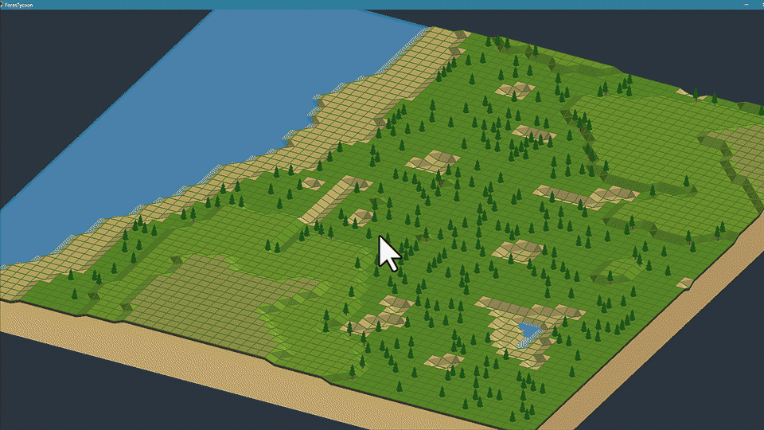

# ForesTycoon

## Live Preview



## Magyar osszefoglalo

A `ForesTycoon` egy kiserleti, csempes alapu jatekmotor-projekt, amely a klasszikus Transport Tycoon jellegu gondolkodast viszi tovabb erdeszeti es erdogazdalkodasi iranyba.

A jelenlegi allapot fokusza:

- 3D izometrikus terepmegjelenites
- node- es tile-alapu terepmodell
- procedurális terepgeneralas
- alloviz, folyok es partvonal-logika
- interaktiv terepszerkesztes
- kamera- es nezetrendszer finomitasa

A projekt meg prototipus fazisban van. A hangsuly most a terepmotoron, a vizmegjelenitesen, a kameraelmenyen es a szerkesztesi workflow-n van.

## English Summary

`ForesTycoon` is an experimental tile-based engine prototype inspired by the Transport Tycoon style of simulation design, but redirected toward forestry and forest management gameplay.

The current prototype focuses on:

- 3D isometric terrain rendering
- node and tile based terrain representation
- procedural terrain generation
- standing water, rivers, and shoreline logic
- interactive terrain editing
- camera and view-control polish

The project is still in prototype stage. Right now the emphasis is on terrain technology, water rendering, camera behavior, and the core editing loop.

## Tech Stack

- C#
- .NET 8
- Windows Forms
- OpenTK 3.3.3

## Run

Requirements:

- Windows
- .NET 8 SDK

From the repository root:

```powershell
dotnet run --project .\ForesTycoon\ForesTycoon.csproj
```

You can also open `ForesTycoon.sln` in Visual Studio.

## Controls

- Left mouse: rotate camera
- Right mouse: pan view
- Mouse wheel: zoom
- Left / Right arrow: rotate toward fixed isometric directions
- Up / Down arrow: change tilt angle
- Left click on a node: raise terrain
- Right click on a node: lower terrain

## Project Structure

- [ForesTycoon/Terrain.cs](ForesTycoon/Terrain.cs): terrain generation, water, trees, terrain rendering logic
- [ForesTycoon/Viewport.cs](ForesTycoon/Viewport.cs): OpenGL viewport, camera, input
- [ForesTycoon/Tile.cs](ForesTycoon/Tile.cs): tile representation
- [ForesTycoon/Node.cs](ForesTycoon/Node.cs): node representation
- [ForesTycoon/VertexBuffer.cs](ForesTycoon/VertexBuffer.cs): lightweight OpenGL buffer handling

## Current Direction

Planned next steps include:

- faster partial terrain and hydrology updates
- improved river bed and water surface rendering
- biome and terrain-type layers
- forest growth and forestry gameplay systems
- later transport, roads, and industrial chains
