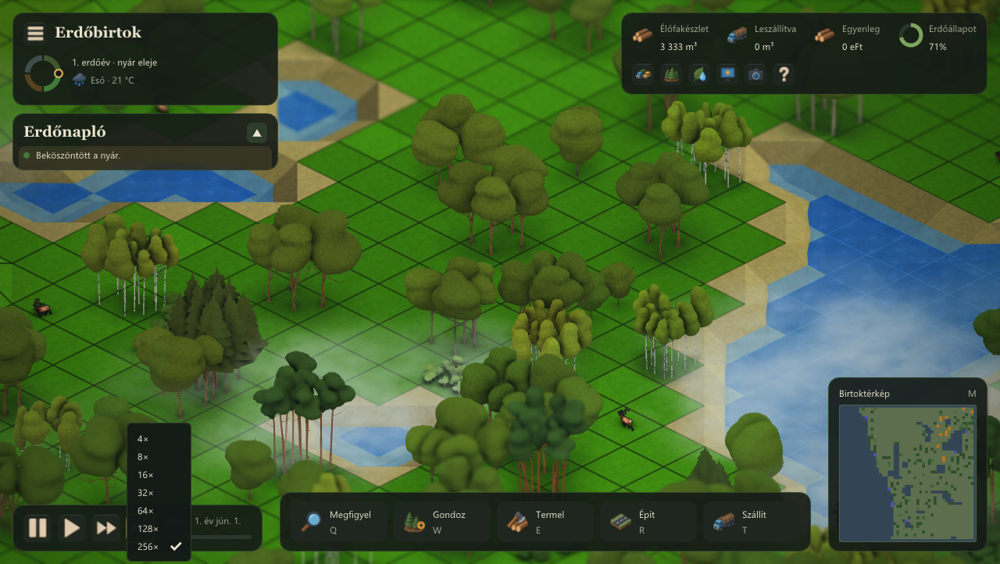
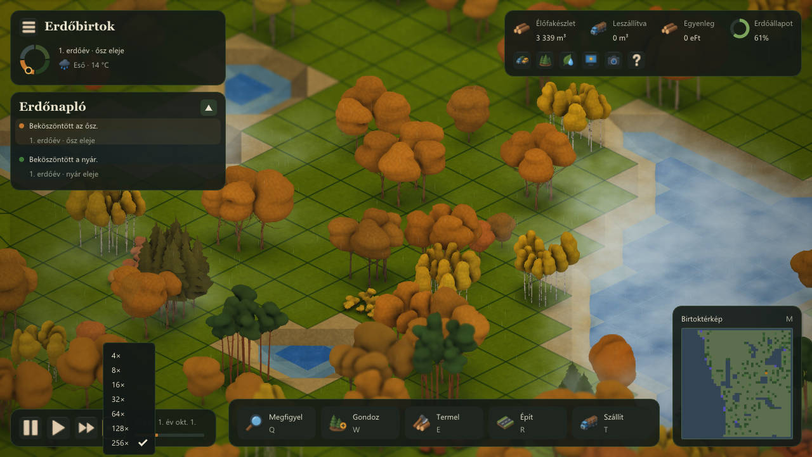
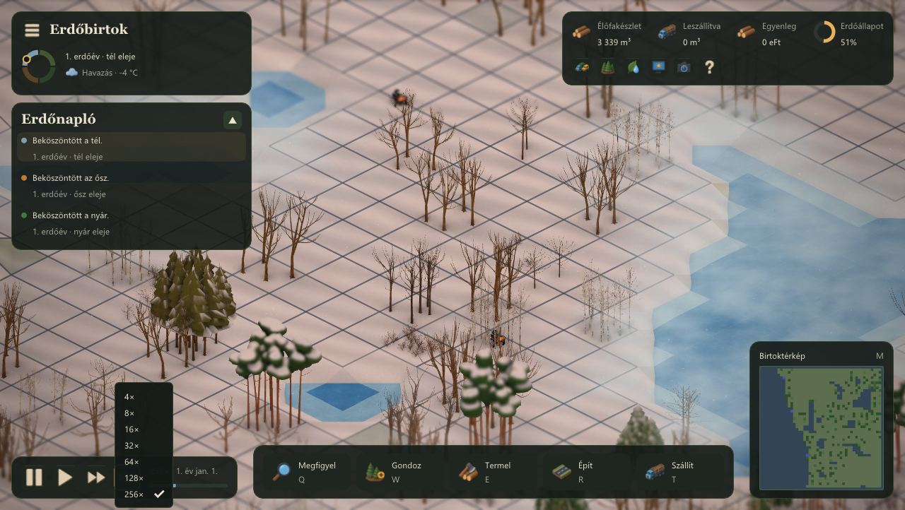

# ForesTycoon

**English** | [Magyar](README.hu.md)

**A forestry management game in a living isometric diorama.** Grow a varied forest, follow the seasons, build roads, and organize harvesting and timber transport.

ForesTycoon is in active development, with a **paid game release planned**. GitHub hosts development, issue reporting, and technical documentation; a release date and price have not been announced. Financial support options are being prepared.



| Autumn foliage | Winter forest |
| --- | --- |
|  |  |

These screenshots come from the actual game window, using the same close-up view at 256× simulation speed. Diorama rendering is enabled.

## Current gameplay and simulation

- **Living forest:** 16 tree and shrub species; individual tree IDs, age, trunk diameter, height, crown size, light, and water supply. Growth, canopy competition, natural regeneration, self-thinning, stumps, and deadwood.
- **Seasonal diorama:** species-specific crowns and surface patterns, with distinct gold, ochre, copper, and reddish autumn colors. Healthy spring and autumn crowns remain solid; foliage disappears when leaf fall finishes, revealing detailed winter branches. Evergreens retain their needles; larch is deciduous.
- **Weather and snow:** more frequent, sustained autumn rain; brief summer showers and severe storms; drifting, gently falling winter snowflakes. Snow storage varies by tile, wind redistributes snow, and meltwater enters the water system.
- **Terrain and water:** procedural maps, rivers and standing water, local soils and climate, and terrain editing. The tile grid is enabled by default and turns cool gray in winter and on snowy terrain.
- **Forestry and transport:** designated harvesting areas, row plantations, log depots, sawmills, loading, and truck transport. Vehicles follow the actual road network and retain their cargo if a route breaks.
- **Roads:** asphalt, gravel, and skid trails; connections, wear and repair, and wet and snowy road surfaces.
- **Wildlife:** deer movement adapted to habitat, walking and grazing animations, and fish swimming in the water.
- **Observation and saves:** estate map, management views, environmental data, game saves, and deterministic simulation continuation.

At the default 1× speed, deer and vehicles move at a natural pace. In a new world, one forest year spans 900 simulated seconds: approximately one real hour at the game's 1× calendar pace, or a theoretical 14.06 seconds at 256×. Actual progress can also depend on machine load.

In close-up views, a tree model being built in the background must not replace an already visible detailed model with a coarser LOD. Seasonal foliage colors and leaflessness follow the current year on the GPU without waiting for mesh rebuilds. The latest in-game check kept every visible chunk at Near detail for two complete years and 1,633 frames at 256×.

## Development setup

Requirements: **.NET 8 SDK**, OpenGL 3.3 core support, and Windows, Linux, or macOS. On Linux, the bundled ImGui.NET native library requires glibc 2.38 or newer, for example Ubuntu 24.04. Current automated platform checks target Windows and Linux.

```sh
dotnet restore ForesTycoon.sln
dotnet run --project ForesTycoon -c Release
```

You can also open the solution in Visual Studio. Purchased models installed locally are optional: without them, the game uses repository models or fallback geometry. Purchased source models are excluded from the public repository; see the [local asset policy](docs/logging-facility-assets.md).

## Controls

| Action | Control |
| --- | --- |
| Rotate camera in observation mode | Left-drag; left/right arrow |
| Pan / zoom | Right-drag / mouse wheel |
| Camera tilt / reset view | Up/down arrow / Home |
| Pause / simulation speed | Space / HUD speed selector, 1×–256× |
| Observe / tend / build | Q / W / R |
| Produce / transport | E / T |
| Vehicles / forestry | V / F |
| Environment / management / graphics | K / M / G |
| Save / load | Ctrl or Cmd + S / L |
| Help / developer tools | F1 / F12 |

Quicksaves are stored in `ForesTycoon/quicksave.json` under the operating system's local application-data directory. The in-game help lists detailed tools and shortcuts.

## Engine and rule editor

C# and .NET 8, OpenTK 4.9.4, OpenGL 3.3 core, GLSL, and ImGui.NET. The fixed-step simulation can run without graphics; rendering uses separate resource environments and chunk geometry built in the background.

| Project | Responsibility |
| --- | --- |
| [ForesTycoon](ForesTycoon) | Game window, HUD, interactions, world, saves, forestry, and transport |
| [ForesTycoon.Engine](ForesTycoon.Engine) | Clocks, fixed steps, systems, job scheduling, and animation timing |
| [ForesTycoon.Ecology](ForesTycoon.Ecology) | Forest, species, growth, soil, water, regional climate, and weather |
| [ForesTycoon.Map](ForesTycoon.Map) | Terrain data, generation, hydrology, roads, and editing rules |
| [ForesTycoon.TreeModels](ForesTycoon.TreeModels) | Species-specific skeletons, trunks, crowns, and levels of detail |
| [ForesTycoon.Rendering](ForesTycoon.Rendering) | GPU devices, shaders, buffers, and rendering environments |
| [ForesTycoon.Models](ForesTycoon.Models) | glTF/GLB models, skeletons, animation, and rendering |
| [ForesTycoon.Effects](ForesTycoon.Effects) | Precipitation, clouds, fog, lightning, and visual effects |
| [ForesTycoon.Rules](ForesTycoon.Rules) | Versioned rule catalog and editable rule models |
| [ForesTycoon.Editor](ForesTycoon.Editor) | Standalone rule-system editor |
| [ForesTycoon.Tests](ForesTycoon.Tests) | Simulation, architecture, save, and resource tests |

```sh
dotnet run --project ForesTycoon.Editor -c Release
```

The editor displays the game's rules, formulas, and catalog of relationships. Road-wear parameters and connections can be edited, tried in a separate test world, and saved as JSON. In the game, **F12 → Szabálymodell → Szabálymodell alkalmazása** loads the model. See the [editor guide](docs/rule-editor.md).

## Validation and documentation

[Engine validation](https://github.com/primuszp/ForesTycoon/actions/workflows/engine-validation.yml) runs Windows/Linux builds, unit tests, and native graphics checks on Linux Mesa/Xvfb. The separate [hardware validation workflow](https://github.com/primuszp/ForesTycoon/actions/workflows/engine-hardware-validation.yml) provides Windows native and performance checks.

```sh
dotnet build ForesTycoon.sln -c Release -warnaserror
dotnet test ForesTycoon.Tests -c Release
dotnet run --project ForesTycoon -c Release -- --smoke-test
```

Run the complete validation suite in PowerShell:

```powershell
./tools/verify-engine.ps1 -Native
```

The actual in-game seasonal check runs for two forest years at 256× in close-up, verifies detail every frame, and saves screenshots:

```sh
dotnet run --project ForesTycoon -c Release -- --capture-seasons artifacts/seasonal-256x
```

The latest local validation passed **1,589 unit tests and the complete Windows native suite**, with no Release build warnings or errors. A new performance-gate run with an otherwise idle GPU remains pending; visual validation does not replace it.

- [Architecture and project dependencies](docs/architecture.md)
- [Game-engine code review and fixes](docs/engine-review-2026-10-10.md)
- [Large-world performance plan and measurement gates](docs/large-world-performance.md)
- [Ecosystem and regional processes](docs/ecosystem-simulation-design.md)
- [Individual tree lifecycle](docs/tree-individual-lifecycle-plan.md)
- [Tree-generation literature and species models](docs/tree-generation-literature.md)
- [Research behind weather, storms, and snow](docs/rain-storm-cloud-research.md)
- [Model import and GPU resources](docs/model-import-contract.md)

## Support and feedback

A financial support page has not yet been created; its official link will be added here when available. For now, you can help by following the project, starring the repository, and submitting reproducible [bug reports and ideas](https://github.com/primuszp/ForesTycoon/issues). For bug reports, include your operating system, GPU, revision, and reproduction steps.

## Licensing and the planned paid release

The goal is to prevent others from using ForesTycoon's own code in commercial products or revenue-generating services without permission. An [unmodified proposal](docs/licensing/PolyForm-Noncommercial-1.0.0.md) for **PolyForm Noncommercial 1.0.0** has been prepared. **It is not yet the effective license for the integrated game.**

The current tree generator directly incorporates DendroKit/Arbaro GPL code and GPL-derived parameter sets. A commercial-use restriction therefore cannot simply be applied to the combined game: the GPL dependency must first be replaced appropriately or covered by sufficient separate permissions. Third-party licenses remain applicable; the proposal does not restrict rights granted by them.

For the current status, exceptions, and paid-release requirements, see **[LICENSING.md](LICENSING.md)**. Public availability of source code does not, by itself, grant unrestricted commercial-use permission.

Replacing the tree generator is a separate, deferred task. This update addresses documentation and the licensing proposal.
