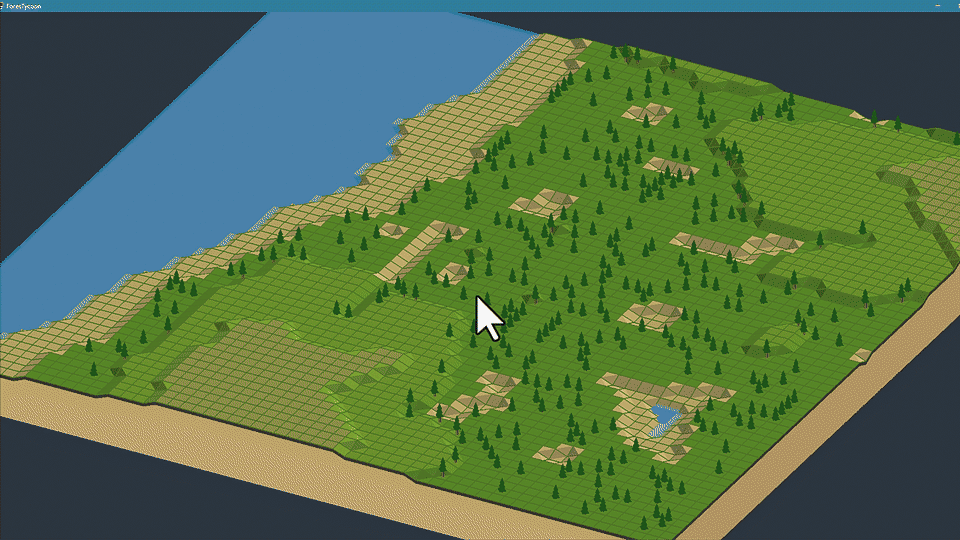

# ForesTycoon

## DendroKit alapú procedurális fák

Az alapértelmezett eljárásos famód az átemelt DendroKit ággenerátorát használja.
A luc, nyír, tölgy és bükk egyedi seedje, kora és szimulált fényellátása eltérő,
fajra jellemző ágstruktúrát (örvös luc, villás, terebélyes tölgy, lecsüngő nyír,
kupolás bükk) és összefüggő poligonális koronát ad. A levélpontok egyetlen tömör
koronát formálnak; a poligonszám a képernyőn látható sziluetthibából adódik.
Nincs levélgeometria vagy alfa-kivágás. Cserjék: mogyoró és galagonya.
Összehasonlító képek: `dotnet run --project ForesTycoon -- --dendro-tree-preview`.
Részletek és forrásmegjelölés: [DendroKit integráció](docs/dendrokit-integration.md),
[irodalmi áttekintés és fajmodellek](docs/tree-generation-literature.md).

## Egyedi fák és folytonos növekedés

Az új világok fái saját azonosítót, kort, törzsátmérőt, magasságot és koronaméretet kapnak. Hónapon belül folyamatosan nőnek a GPU-n, háló-újraépítés nélkül; az érett fák tovább vastagodhatnak. A részrakodás egész fákat vág ki, a teherautó a helyi rönkdepóból vesz át, és a tönk az adott fa méretét őrzi. Az Erdészet ablak az egyedek számát és az előző évi növedéket is mutatja. Minden világ az egyedi famodellt használja; régi mentésekhez nincs kompatibilitási ág.

Ellenőrzés: `dotnet run --project ForesTycoon -- --tree-growth-smoke-test`. A részletek és a még hátralévő öregedési/kidőlési szakasz az [első megvalósítási lépcső leírásában](docs/tree-individual-implementation.md) találhatók.

## Live Preview



## Magyar osszefoglalo

A `ForesTycoon` egy kiserleti, csempes alapu jatekmotor-projekt, amely a klasszikus Transport Tycoon jellegu gondolkodast viszi tovabb erdeszeti es erdogazdalkodasi iranyba.

A jelenlegi allapot fokusza:

- 3D izometrikus terepmegjelenites
- node- es tile-alapu terepmodell
- procedurális terepgeneralas
- alloviz, folyok es partvonal-logika
- interaktiv terepszerkesztes
- kamera- es nezetrendszer finomitasa
- determinisztikus erdoszimulacio negy fafajjal (luc, nyir, tolgy, bukk)
- fafajonkent egyedi novekedes, termohely-igeny, arnyektures es faanyag-ertek
- lombkorona-versenges es onritkulas, termeszetes ujulas a magot ado allomanyok korul
- fafajonkent kulon 3D famodell (sziluett, torzs es korona szin)

A projekt meg prototipus fazisban van. A hangsuly most a terepmotoron, a vizmegjelenitesen, a kameraelmenyen es a szerkesztesi workflow-n van.

## English Summary

`ForesTycoon` is an experimental tile-based engine prototype inspired by the Transport Tycoon style of simulation design, but redirected toward forestry and forest management gameplay.

The current prototype focuses on:

- 3D isometric terrain rendering
- node and tile based terrain representation
- procedural terrain generation
- standing water, rivers, and shoreline logic
- interactive terrain editing
- camera and view-control polish
- deterministic forest simulation with four species (spruce, birch, oak, beech)
- per-species growth, site requirements, shade tolerance and timber value
- canopy competition and self-thinning, with regeneration around seeding stands
- a distinct low-poly 3D model per species

The project is still in prototype stage. Right now the emphasis is on terrain technology, water rendering, camera behavior, and the core editing loop.

## Tech Stack

- C#
- .NET 8
- OpenTK 4 cross-platform `GameWindow`
- OpenGL 3.3 core-profile renderer with GLSL, VAO/VBO batching and shader-based ImGui
- ImGui.NET

## Run

Requirements:

- macOS, Windows or Linux with OpenGL 3.3 core support
- .NET 8 or newer SDK

From the repository root:

```sh
dotnet run --project ForesTycoon/ForesTycoon.csproj
```

You can also open `ForesTycoon.sln` in Visual Studio.

The test suite is cross-platform:

```sh
dotnet test ForesTycoon.sln
```

To validate native window creation and rendering in CI or on a new machine:

```sh
dotnet run --project ForesTycoon/ForesTycoon.csproj -- --smoke-test
```

The smoke test renders 120 frames and exits automatically.

## Controls

- Left-drag in inspect mode: rotate camera
- Right-drag: pan view
- Mouse wheel: zoom
- Left / Right arrow: rotate toward fixed isometric directions
- Up / Down arrow: change tilt angle
- Left click with the raise/lower tool: edit terrain
- Left-drag with the road tools: build or remove a path
- Left click with the planting tool: plant the selected species (spruce, birch, oak or beech)
- Left click with the harvesting tool: cut a stand and add its biomass to the timber stockpile
- Cmd/Ctrl+S: quicksave
- Cmd/Ctrl+L: quickload
- 1–8: tools in toolbar order (inspect, raise, lower, road, remove road, plant, harvest, sawmill); Esc: back to inspect
- Space: pause · T: launch log truck · Home: reset camera
- V / F / E / G: vehicles / forestry / environment / graphics window · F1: help · F12: developer tools

Quicksaves are stored under the operating system's local application-data directory in `ForesTycoon/quicksave.json`.

## Project Structure

- [ForesTycoon/App](ForesTycoon/App): window, OpenGL context, frame loop, camera and platform input
- [ForesTycoon/Interaction](ForesTycoon/Interaction): testable user-intent and editing gesture handling
- [ForesTycoon.Engine](ForesTycoon.Engine): game-agnostic runtime kit (fixed-step time, systems, jobs, animation timing)
- [ForesTycoon.Ecology](ForesTycoon.Ecology): the ecosystem simulation - weather, soil, water, species and forest; headless and deterministic
- [ForesTycoon.TreeModels](ForesTycoon.TreeModels): species-level procedural tree and shrub models (Arbaro-format presets)
- [ForesTycoon.Rendering](ForesTycoon.Rendering): GPU core of the renderer (device, shaders, pipeline, buffers, post-processing)
- [ForesTycoon.Models](ForesTycoon.Models): glTF/GLB model loading, animation and drawing
- [ForesTycoon.Effects](ForesTycoon.Effects): weather, clouds, fog, lightning and action markers
- [ForesTycoon/World](ForesTycoon/World): game world, commands, save/replay, vehicles and effects
- [ForesTycoon/Terrain](ForesTycoon/Terrain): terrain data, generation, hydrology, roads and chunk updates
- [ForesTycoon/Rendering](ForesTycoon/Rendering): ordered render pipeline and GPU helpers

The layering (Engine ← Ecology/Rendering ← TreeModels/Models/Effects ← game) is described in [docs/architecture.md](docs/architecture.md) and enforced by the architecture tests.
- [ForesTycoon/Diagnostics](ForesTycoon/Diagnostics): frame, simulation, allocation and draw-call metrics
- [ForesTycoon/Camera](ForesTycoon/Camera): platform-independent isometric camera state
- [Engine architecture](docs/engine-architecture.md): responsibility boundaries, performance policy and roadmap

## Current Direction

Planned next steps include:

- faster partial terrain and hydrology updates
- improved river bed and water surface rendering
- biome and terrain-type layers
- placeable timber depots, route assignment and delivery contracts
- later transport, roads, and industrial chains

Forest cache and LOD integration check (requires OpenGL):

```sh
dotnet run --project ForesTycoon/ForesTycoon.csproj -- --forest-smoke-test
```

This hidden-window test checks cached geometry reuse, detail reduction, and geometry refresh after planting, harvesting and terrain edits.

## Erdő látványminta

A képreferenciához készített, rögzített 16×16 csempés erdőminta külön nézetben indítható:

```sh
dotnet run --project ForesTycoon/ForesTycoon.csproj -- --forest-preview
```

Bal egérhúzás: forgatás; görgő: zoom; bal/jobb nyíl: 45° forgatás; fel/le nyíl: kameradöntés; Esc: bezárás. A mintában négy fafaj, összefüggő lombkorona, ritkuló tisztásszegély és enyhe tereplépcső szerepel. A minta nem ír játékmentést.

36 összehasonlítható PNG exportja (4 kamerairány × 3 dőlés × 3 zoom):

```sh
dotnet run --project ForesTycoon/ForesTycoon.csproj -- --forest-preview --capture artifacts/forest-preview
```

Az új stilizált koronák, finom kontúrok és talpközeli árnyékok a normál játék erdőrenderelőjében is működnek. A mintaterület egy külön kezdeti állapot; a normál játék kezdőerdő-generátora és mentési formátuma változatlan.

Zoom/forgatás és futó erdőszimuláció terheléses mérése:

```sh
dotnet run --project ForesTycoon/ForesTycoon.csproj -- --camera-benchmark
```

## Rönkszállító teherautó

Az új játékok járművei háromtengelyes, forgó kerekű rönkszállítók. A rakomány mennyiségét legfeljebb kilenc látható rönk jelzi; üresen a tartórudazat marad. Az út befagyasztott vezetőfelületét követik, kanyarban negyedíven fordulnak, az első/hátsó tengely környezetéből számolt dőléssel és keresztlejtéssel. Egyszerű gyorsulás, terhelés- és emelkedőfüggő sebesség, kanyar előtti lassítás és végponti fékezés működik, fix szimulációs lépésekben.

Ez útvonalhoz kötött kinematikai modell: még nincs ütközés, forgalomkövetés vagy külön kerékfelfüggesztés. A végponton megállás után a meglévő automatikus irányváltás történik. A korábbi mentések megőrzik az eredeti állandó sebességű szimulációt, hogy a parancsnapló visszajátszásakor a szállítások időzítése ne változzon; az új mentések külön járműfizika-verziót tárolnak.

Grafikus ellenőrzés és három PNG (rakott emelkedő/lejtő, üres síkút), az `artifacts/truck-preview` könyvtárba:

```sh
dotnet run --project ForesTycoon/ForesTycoon.csproj -- --truck-smoke-test
```

## Grafika és időjárás

A Nézet menüben az Új grafikai megjelenítés kapcsolóval az eredeti színalapú mód is visszaállítható. A Textúrázás, Napfény, Vetett árnyékok és Csemperács külön kapcsolható; a nap iránya és magassága állítható. Ezek a beállítások a futó játékban megmaradnak térképcsere közben.

Új világokban a látvány a Környezet 1.0 rendszer tartós eseményeit követi. A Nézet / Időjárási kép menü Napsütés, Borult, Eső és Vihar választása külön látványteszt; a Szimulált időjárás látványa kapcsolóval visszaállítható a környezet hiteles időjárása. A Felhőzet és Villámlás külön kapcsolható. Az eső nedvesíti a talajt, amely utána fokozatosan szárad; a szünet megállítja az effekteket. A hó kísérleti kódja megmaradt, de a normál játék nem kapcsolja be.

A vihar szélirányba dőlő, világkoordinátákhoz rögzített esőt, térfogati felhőhátteret, puha mozgó felhőárnyékot, villámfényt és procedurális vízgyűrűket használ. A [grafikai terv](docs/graphics-weather-plan.md) és a [kutatási jegyzet](docs/rain-storm-cloud-research.md) ismerteti a technikákat és a közelítéseket.

Ellenőrzés: dotnet test ForesTycoon.sln --no-restore; a lefordított játék --graphics-smoke-test kapcsolója PNG-ket ment az artifacts/graphics-weather mappába, és ellenőrzi a grafikai kapcsolókat, a cache megőrzését és az eredeti kép visszaállítását.


Viharban most elágazó, fényudvarral rajzolt villámcsatornák is megjelennek: a kisülések végpontja egy látható fa koronája. A **Talajköd** kapcsoló és **Köd sűrűsége** csúszka az erdő alacsony, lassan sodródó ködfoltjait szabályozza. A talajköd alapból engedélyezett, és a helyi körülmények alapján foltokban jelenik meg. A Villám most gomb azonnali kisülést indít, akár szünet alatt is. A villám csak látványelem, nem károsítja a fákat.


A talajköd most **soft particle rendszer**: világkoordinátákban sodródó, eltérő életciklusú, zajmintás ködpamacsok jelennek meg az erdőben és a széleken. A részecskék fokozatosan megjelennek, növekednek és eltűnnek; a jelenet mélységéből számított átmenet lágyítja a talajjal és a fákkal való metszést. A Köd sűrűsége csúszkával állítható a hatás.


A köd most a környezethez igazodik: erdőben, víz mellett és helyi terepmélyedésekben jelenhet meg, lassan változó, összefüggő foltokban. Eső után a nedves talaj növeli az esélyét és sűrűségét; erős szél és napsütés gyengíti. Az utak önmagukban nem képeznek ködöt, de nedves völgyekben vagy vízparton azok mentén is megjelenhet. Ez vizuális mikroklíma-közelítés, hőmérséklet/harmatpont szimuláció nélkül.

**Fájl / Új nagy erdős térkép**: Fenyves és lombos erdő, Nagy fenyves vagy Nagy lombos erdő. A menüpont új térképet készít a választott térképmérettel. Nagy, összefüggő erdőtömbök és tisztások keletkeznek; a víz, utak és térképszél kizárása megmarad. Az új seed és a térképméret-váltás megtartja a kiválasztott erdőmintát. A mintát a mentés tárolja, a világ betöltése ugyanazt a generátort használja.


A játék járműve most az átadott trucks_collection.glb gyűjteményből kiválasztott, világoskék rönkszállító. A külön kivágott Assets/Vehicles/log-truck.glb automatikusan a program mellé másolódik. A kerekek forognak, a jármű az út lejtéséhez igazodik, a hat külön rönk pedig a rakomány mennyisége szerint jelenik meg. Az eredeti színalapú grafikai mód működik ezzel a modellel is. Az import részletei az [asset leírásában](ForesTycoon/Assets/Vehicles/README.md) találhatók.

A rönkszállító egyenletesen skálázva az aszfaltozott egyetlen sáv szélességének 80%-át foglalja el, így a térképmérettől és csempemérettől függetlenül illeszkedik az úthoz.


A rönkszállító az íveket a modell tényleges tengelytávolságával mintavételezi, folyamatosan változó helyzettel és iránnyal. Az első kerekek előretekintő, ívfüggő Ackermann-kormányzást kapnak, így a belső kerék nagyobb szögben fordul. A felépítmény finom fel-le mozgása és billenése az út magasságváltozásától, a sebességtől és a rakománytól függ; sima úton minimális, egyenetlen úton erősebb. Ez látványbeli rugózás, nem teljes futóműfizika. A szállítási út két végpontján a rakodáshoz szükséges megállás megmarad; köztes íveken a jármű továbbhalad.

### Motor teljesítménye

A Nézet menüben választható alacsony, közepes vagy magas effektminőség. A mérési eredmények, a megvalósított optimalizálások és a további skálázási feladatok a [motoráttekintésben](docs/engine-performance.md) találhatók. Az `--engine-benchmark` az alapjeleneteket, az `--engine-stress-benchmark` a sűrű erdőt és az 1/25/100 teherautós vihart méri.

### Teherautó és rakodás

Új világban a teherautó kitermelt faanyagra vár, három másodperc alatt rakodik, majd a célvégponton külön lerakodik. Az állapot és a rakomány a járműlistában látható. A Nézet menü Járműkontúrok kapcsolója finom sötét vonalat ad a közeli modelleknek. A rönkök külön faanyagot kaptak, a kormányzás átmenete simább. Minden világ ezt a rakodási rendet használja. A nagyobb sugarú útívek és a környezet szimulációja a [következő szakasz terve](docs/vehicle-environment-plan.md).

### Animált erdei szarvasok

A Nézet → Erdei szarvasok kapcsolóval legelő és lassan sétáló szarvasok jelennek meg az erdők tisztásain/szélein. A Szarvas megkeresése menüpont rájuk közelít. Az importált GLB valódi csontvázas animációt, textúrákat és árnyékot használ, a szünetet követi. A [betöltő, animáció és ellenőrzések leírása](docs/animated-models.md) tartalmazza a támogatott formátumrészhalmazt; a `--wildlife-smoke-test` képi ellenőrzést futtat.


## Időjárás, talaj, víz és faegyedek

A kijelölt erdőtelepítések tartós borostyánsárga határt és sorjelölést kapnak. Csempénként 6×6 csemete nő a fajára jellemző életfázisokon keresztül. Az egyedek a fényért, vízért és növőtérért versengenek; a tartósan elnyomott fák elhalnak, majd kidőlnek. A Vizsgálat eszköz mutatja a telepítés egyedszámát és erőforrásmutatóit. Modell, források, mentés és ellenőrzés: [erdőtelepítés és dinamika](docs/forest-plantation-dynamics.md). Képi próba: `dotnet run --project ForesTycoon -- --plantation-smoke-test`.

Új világban egy erdőév 20 játékperc. A vízidő átváltása 1 játékperc = 1 környezeti óra. Az események nem képkockánként váltakoznak: napos idő 2–5 perc, borult idő 1–3 perc, eső 45–120 másodperc, vihar 20–60 másodperc. Az eső intenzitása mm/környezeti óra; a felerősödés és lecsengés integrálja adja a lehulló vizet.

A **Környezet 1.0** panelen látható az esemény hátralévő ideje, intenzitása, lehulló/várható vízmennyisége, hőmérséklet és szél. A csempére mutatva a koronavíz, felszíni víz, gyökérzóna és vízstressz olvasható. Az **Időjárási esemény indítása** részben állítható a típus, csúcsintenzitás és időtartam; az indítás a tényleges vízkészletet módosító, menthető parancs. Bezárt panel a Játék → Környezeti panel kapcsolóval nyitható újra.

Csempénként koronaintercepció, beszivárgás, párolgás, növényi vízfelvétel, mélyebb tároló és lejtő menti lefolyás működik. A fél játék-másodperces vízlépéseket és a havi erdőnövekedést közös koordinátor rendezi. A felhőzet csökkenti a tényleges besugárzást; az élő koronák levélfelülete vízigényt ad, a növekedéshez felhasznált víz pedig valóban levonódik a talajból. A havi teljesített vízigény és túlnedvesség hat a növekedésre és egészségre. Kivágáskor a szomszédok több fényt kapnak, a koronavíz a felszínre kerül. A helyi nedvesség a terepanyagokra és a ködfoltokra is hat. A szünet és gyorsítás közös; textúrázás és effektek kikapcsolása nem változtatja meg a vízmérleget.

A mentés **4-es formátumverziója** az eredeti seedből, parancsnaplóból és tick-számból pontosan újraszámolja a környezetet és az egyedeket. A 3-as és korábbi verziók nem tölthetők be az új növekedési szabályokkal; a régi fájlok megmaradnak, automatikus migráció nincs.

Az első modell egy effektív talajprofilt használ. A tavak/folyók vízszintje még rögzített; a mélyebb alapvízhozamot és térképi kifolyást könyvelt veszteségként kezeli. Fagy/jég, hóborítás, csúszós út és erdőtűz későbbi fejlesztés. Ez gyors növekedésre hangolt játékmodell; nem 365 napos fizikai éves hidrológiai előrejelzés.

Aktuális modell, felelősségek és korlátok: [időjárás–talaj–fa kapcsolat](docs/environment-forest-coupling.md). Korábbi terv: [környezeti szimuláció](docs/environment-simulation-plan.md).

A `--simulation-benchmark` grafika nélkül méri a havi erdőfrissítést, a helyi kitermelést és a versengés hónap közbeni előkészítését. Az előkészítés csökkenti a hónapváltás terhelését; [mérések és korlátok](docs/engine-performance.md#havi-versengés-fokozatos-előkészítése). Nagy térképen és közvetlenül hónap végi erdőművelésnél még lehet megakadás.

```sh
dotnet run --project ForesTycoon/ForesTycoon.csproj -- --world-benchmark
```

A világbenchmark a valódi világfrissítést és a befejezett GPU-kirajzolást méri egy hónapváltáson át, napsütésben és viharban. Képkockánkénti adatok: `artifacts/world-benchmark`. A havi profil külön méri az erdő/környezet, logisztika és vadállatok költségét; a renderprofil fázisonként CPU- és GPU-időbélyeg-adatokat ment. UI, diorama utófeldolgozás és aktív járműforgalom nincs a mérésben; [eredmények és mérési korlátok](docs/engine-performance.md#játékvilág-és-havi-élőhely-ellenőrzés), [adagolt erdőmesh-feltöltés](docs/engine-performance.md#erdőmesh-feltöltése-adagokban-és-renderfázisok-mérése).

```sh
dotnet run --project ForesTycoon/ForesTycoon.csproj -- --environment-smoke-test
```

A próba az `artifacts/environment` mappába ment képeket, ellenőrzi a nedvesedést/száradást, szünetet, grafikai függetlenséget, mentés visszajátszását és vízmérleget; külön méri a 64², 128² és 256² cellás vízlépéseket.


## Kitermelési területek és fűrészmalmok

A LOD-váltás jelenleg ki van kapcsolva: minden zoomnál a közeli erdőgeometria marad látható.

Új világban a **Kitermelés** eszköz húzással forrásterületet jelöl ki. A narancssárga jelölés tartós; kijelöléskor egyetlen fa sem tűnik el. Minden erdőcsempe rendelkezik faanyaggal, köbméterben (`biomassza × 100 m³`). A köbméter csak a forrásnál történő tényleges rakodás közben csökken; a törzsek a megmaradó biomassza alapján fokozatosan fogynak. A kijelölt terület készlete és a csempe faanyaga a felületen olvasható.

1. Jelölj ki kitermelési területet az erdőben.
2. A **Fűrészmalom** eszközzel kattints 2×2 sík, üres, száraz csempére.
3. Építs összefüggő utat a forrásterület és a malom mellé. Az út a szomszédos csempéken csatlakozik, nem az épület alatt.
4. Nyomd meg a **Rönkszállító indítása** gombot. A rendszer a tényleges úthálózaton keres útvonalat a forrástól a célhoz.

A teherautó a kijelölt forrásnál rakodik, a malomnál fokozatosan lerakodik, majd visszatér. A malom külön könyveli az átvett készletet és a feldolgozott mennyiséget. A forrás kifogyásakor az autó vár; megszakított út esetén megőrzi a rakományát, és az út helyreállítása után folytatja az utat. Épületre út és erdő nem telepíthető, az alatta lévő terep magassága védett.

A megadott `sawmill_paropank.glb` és `animated_low_poly_fish.glb` modellek kerültek be. A vízben a halak csontvázas animációval úsznak; nagy, térképszélhez csatlakozó tengerekben 8–120 hal, kis belső vizekben 1–2 hal jelenik meg, a kellően mély részeken. A víz saját finom rácsa megmarad.

A mentés visszajátssza a kijelölési, építési és teherautó-indítási parancsokat. Az 5-ös formátumverzió az erdőév hosszát is tárolja. A 4-es mentések továbbra is betölthetők, eredeti 1200 másodperces évhosszal.

Ellenőrzés: `dotnet run --project ForesTycoon -- --logistics-smoke-test`. A próba a fokozatos 60 m³-es kitermelést, útkapcsolatot, lerakott malmot, készletmérleget, mentés/visszajátszást és a tengeri/tavi halpopulációt ellenőrzi; képek az `artifacts/forestry-logistics` mappában.

## Menürendszer és diorama-látvány

A felület a Transport Tycoon mintáját követi:

- **Felső ikonsor**, feladat szerinti csoportokban: játék menü (új térkép, térképméret, mentés, betöltés, kilépés) · idő (szünet, 1×/2×, gyorsítási menü 4×–256×) · terep · utak · erdészet · ipar és szállítás · információs ablakok · nézet, grafika, fejlesztői eszközök és súgó. Minden gomb tooltipje mutatja a nevet, a gyorsbillentyűt és egy rövid leírást.
- **Eszköz-alsáv** az ikonsor alatt, csak ha az eszköznek vannak beállításai (fafajválasztó ikonokkal, ecsetméret, építési tipp).
- **Állapotsor** alul: aktív eszköz, erdőév és évszak, időjárás, sebesség, leszállított faanyag, járművek.
- **Ablakok**: Járművek, Erdészet, Környezet, Grafika, Súgó. Vizsgálat eszközzel az erdőcsempe adatai az egér mellett jelennek meg; a mentés és az erdészeti műveletek eredménye rövid értesítésként jelenik meg.
- **Fejlesztői eszközök** (F12) egy ablakban: teljesítménymérés, időjárás-teszt és környezeti esemény, új seed és 512×512-es stresszteszt, kamera- és megjelenítés-hibakeresés.

Az ikonok vektorosan, ImGui rajzlistába készülnek ([UI/GameIcons.cs](ForesTycoon/UI/GameIcons.cs)), így nincs szükség ikonfontra vagy képfájlra, és bármilyen DPI-n élesek.

**Arányok** ([Rendering/DioramaScale.cs](ForesTycoon/Rendering/DioramaScale.cs)): a világ nem méretarányos, de a méretsorrend helyes: szarvas < teherautó < fűrészmalom. A teherautó a sáv 62%-át foglalja (≈5,8 egység hosszú), a malom épülete a 2×2 csempés telek 80%-át, az udvari rönkrakások a telek szélén belül maradnak, a szarvas a teherautónál alacsonyabb. A `DioramaScaleTests` ellenőrzi ezt a sorrendet.

**Diorama utófeldolgozás** (Grafika ablak): a jelenet többmintás offscreen célba készül, majd tilt-shift mélységélesség (éles középső sáv, távolról erősebb), mélységpufferből számolt kontakt-árnyékolás a fák, épületek és partok tövében, makrófotó-színkorrekció, vignetta és stúdió háttér kerül rá. Minden hatás külön kapcsolható; alacsony minőségen az AO kikapcsol. A szimulációt nem befolyásolja.

HUD és diorama ellenőrző képek az `artifacts/hud` mappába:

```sh
dotnet run --project ForesTycoon/ForesTycoon.csproj -- --capture-frame artifacts/hud
```

## Fafajonkénti textúrák, tönkök és rácsvonal

**Textúrák**: Textúrázás bekapcsolva minden fafaj saját kéreg- és lombmintát kap. A mintákat a felület-shader procedurálisan rajzolja; a fafaj kódja a csúcsszín alfa-csatornájában érkezik (`Terrain.SurfaceSpeciesCode`).
- Lucfenyő: vörösesbarna, pikkelyes kéreg; kékeszöld, emeletes tűlevél-sávok.
- Nyír: krétafehér kéreg fekete, vízszintes paraszemölcsökkel és foltokkal; apró, csillogó sárgászöld levelek.
- Tölgy: mélyen barázdált kéreg; nehéz, csomós lombtömegek árnyékos hézagokkal.
- Bükk: sima ezüstszürke, foltos kéreg zuzmóval; tömör, réteges lomb.

**Tönkök**: Kitermeléskor (teherautós rakodás vagy azonnali kivágás) a `ForestSystem` megjegyzi a kivágott állományt az első vágás előtti állapotában. A kirajzolás minden eltávolított törzs helyén tönköt rajzol (fajnak megfelelő kéreg, világos fűrészelt lap). A tönk 6 erdőév alatt lesüllyed, besötétedik, bemohásodik, majd eltűnik. Újratelepítéskor a felnövő fák fokozatosan átveszik a helyüket. Ültetést nem akadályoz; útépítéskor a tönk eltűnik. A mentés visszajátszása helyreállítja.

**Rácsvonal**: a csemperács alapból bekapcsolt, minden zoomnál egyetlen 1 pixeles, sötét mohazöld, félátlátszó vonallal készül. A Grafika ablakban kapcsolható.

**Erdő megfigyelése gyorsítva**: a felső ikonsor háromnyilas gombja nyitja a 4×, 8×, 16×, 32×, 64×, 128× és 256× időgyorsítást. A kiválasztott sebesség az alsó állapotsorban látszik; az 1×/2× gombbal vissza lehet lassítani, Space-szel szüneteltetni. Új térképen egy erdőév **120 szimulációs másodperc**, a korábbi érték tizede. A természetes időjárási események, évszakok és vízfolyamatok időskálája ezzel együtt gyorsult; az éves természetes csapadékmennyiség megmarad. 256× mellett az elméleti évhossz 0,47 valós másodperc, a tényleges gépterheléstől függően hosszabb. A mért 64²-es világban körülbelül 3 év telt el 5 másodperc alatt. Régi, 4-es mentés betöltésekor az eredeti évhossz marad; az új ütemet új térkép használja. A fa-, talajvíz-, időjárás- és szállítási rendszerek továbbra is fix lépésekkel haladnak. Az érett fák néhány éves változása kisebb, a fiatal telepítések fejlődése jobban megfigyelhető.

A kiszáradt fa az elhalás után két erdőévvel fekvő holtfává válik. Ez az állapot minden LOD-ban az aktuális erdőévből számolódik, ezért távolodáskor nem vált vissza álló törzsre. Célzott ellenőrzés: `--forest-smoke-test`; ütemezés és régi/új mentés-visszajátszás mérése: `--forest-tempo-benchmark`.

Alapértelmezésként a változatosabb saját eljárásos fák jelennek meg. A lucfenyő, tölgy, nyír és bükk csemete, fiatal, középkorú és idős életfázisai külön ág- és koronageometriát kapnak, fázisonként három változattal. A mód neve **Eljárásos fák (életfázisok)**. Egyedenként változik a korona alakja és a fenyők ágazása; részletek és képi ellenőrzés: [eljárásos változatosság](docs/procedural-tree-variation.md). A **Grafika → Fa modellek** választóval a könnyű importált készlet és az eredeti részletes fenyő is visszakapcsolható; az eredeti fájlok megmaradtak. Az importált nyír külön kapcsolható (CC BY-NC, alapból kikapcsolva). A lomb alpha-kivágást használ; a merev ágak anyagonként összevont, megosztott GPU-geometriával készülnek. Részletek: [modellértékelés](docs/tree-asset-candidates.md), [eredeti lucfenyőmodell](docs/spruce-model-redesign.md). Integrációs képek és ellenőrzés: `dotnet run --project ForesTycoon/ForesTycoon.csproj -- --forest-model-smoke-test`.

Ugyanitt a **Generált fák (EZ-Tree)** mód két fenyő- és két tölgyváltozatot ad, három, közös ágvázból készített részletességi szinten. A generátor előre készít GLB-modelleket; a játék futtatásához JavaScript nem szükséges. A korábbi modellkészletek megmaradnak. Paraméterek, újragenerálás és ellenőrzés: [EZ-Tree integráció](docs/ez-tree-integration.md).
