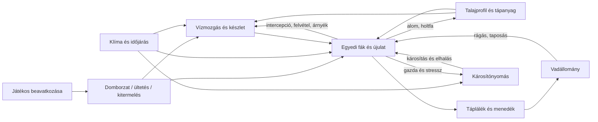

# Térbeli ökoszisztéma-szimuláció

2026-10-08. Ez a dokumentum a következő fejlesztések terve és a terepszerkesztési javítás leírása.
A lent jelölt jövőbeli modulok, új raszternézetek és konfigurációs fájlok még nincsenek megvalósítva.
A korábbi [víz–időjárás terv](environment-simulation-plan.md) történeti előzmény; az ott már elkészült
vízmérleget megtartjuk. A cél játékmodell, szakirodalmi folyamatokkal és későbbi kalibrációval.

## Döntés és tudományos minták

Térbeli hibrid modellt építünk: a csempékhez folytonos készletek és fluxusok, a fákhoz egyedi
állapot tartozik. A vadak mozgó egyedek, de táplálékfogyasztásuk és rágási nyomásuk raszterbe kerül.
A rendszer-dinamika készlet–áramlás és visszacsatolás szemlélete adja az anyagmérlegeket;
egyetlen globális differenciálegyenlet nem írja le jól a szomszédságot, az egyedi fákat és a beavatkozásokat.

| Minta | Mi használható belőle? | Döntés a játékban |
| --- | --- | --- |
| iLand | Egyedi fák, fényverseny, növekedés, elhalás, újulat, térbeli bolygatások; napi klíma és talajadatok. [Áttekintés, 2024](https://doi.org/10.1016/j.ecolmodel.2024.110785) | Ez a legközelebbi ökológiai minta; a folyamatokat egyszerűsítjük és külön kalibráljuk. |
| LANDIS-II | Egymással explicit core-interfészen kapcsolódó ökológiai bővítmények. [Hivatalos leírás](https://www.landis-ii.org/extensions) | A modulhatár és térképi folyamatok mintája; nem vesszük át a teljes kutatási futtatórendszert. |
| APSIM Next Generation | .NET modellek, óra által kibocsátott események, víz/növény/károsítás interfészek. [Model design](https://docs.apsim.info/docs/development/software/modeldesign), [interfaces](https://docs.apsim.info/docs/development/software/interfaces) | A külön folyamatok és a közös erőforrás-allokáció mintája. |
| Math.NET Numerics | RK2/RK4 skalár és vektoros ODE-megoldók. [API](https://numerics.mathdotnet.com/api/MathNet.Numerics.OdeSolvers/RungeKutta.htm) | Lehetséges offline referencia és kalibráció; nem szimulációs ütemező vagy raszteres ökoszisztéma. |

**Javaslat:** a meglévő .NET Engine/Ecology rétegen belül kis, explicit folyamatfuttatót építsünk,
a már működő víz–erdő koordinátor fokozatos általánosításával. Most nem adunk hozzá új külső függőséget.
A kész kutatási modellek közvetlen beágyazását külön prototípusban kellene vizsgálni: lépték, futásidő,
állapotmentés, interaktív beavatkozás és licencelés szerint. Az APSIM felhasználását külön licencfeltételek
szabályozzák; a forrás elérhetősége nem önmagában integrációs engedély. [Hivatalos regisztráció/licenc](https://registration.apsim.info/)

## Jelenlegi állapot és a terepszerkesztési hiba

Meglévő alapok: `TerrainMap` raszter és topológia; `ForestTreeStore` stabil egyedi faazonosítók;
`ForestCompetition` szomszédsági erőforrás-verseny; `EnvironmentSystem` korona/felszín/talaj/mélyvíz
készletek és ellenőrzött vízmérleg; `WeatherSystem` determinisztikus események;
`ForestEnvironmentCoordinator` vízlépés/havi erdőlépés összehangolása; `WildlifeSystem` éhség és
helyi táplálékkimerülés; parancsnapló-alapú mentés. A valós `TerrainMap` talajparaméterei jelenleg
az alap `SoilProperties.Standard` értéket használják. Nincs teljes talajtípus-, regionális klíma-,
fertőzés- vagy rágási visszacsatolási raszter. A meglévő mélyvízkészlet nem kalibrált talajvízszint.

A javított hiba két forrása:

1. `RefreshHabitat()` szerkesztés után minden fa növekedési sebességét és erőforrásait frissítette,
   akkor is, ha az adott csempe változatlan maradt. Ez az egész erdő új értékelésének látszatát keltette.
2. A terep-geometriát a térkép globális `SurfaceVersion` értéke érvénytelenítette. A lokális művelet
   így minden látható terrain chunkot újraépített. Egy nem rajzolt régi rács-VBO is teljesen újratöltődött.

A most megvalósított működés:

- Az ecset a valóban módosított csomópontokhoz tartozó csempéket adja vissza, rendezett, egyedi listában.
  A lejtéskorlát miatti kaszkád ténylegesen megváltozott csempéi is beletartoznak.
- Az ottani élő fa, holtfa, tönk, depó és telepítési kijelölés elveszik; nem lesz belőle kitermelt készlet.
  A többi fa azonosítója, seedje, mérete, kora, egészsége és növekedési intervalluma változatlan marad.
- A beavatkozás nem lépteti az időjárást, vízkészletet vagy erdőévet. A szomszédok versenyválaszát
  a következő rendes havi lépés számítja ki, az előkészített havi adatok helyi javításával.
- A környezeti lefolyási célok csak a módosult csempéken és közvetlen szomszédaikon frissülnek.
- A terrain/grid cache chunkonkénti felületverziót használ. A nem használt globális rácsbuffer megszűnt.
  Az erdőcache továbbra is az érintett chunkot/kapcsolódó kontaktárnyék-határt frissíti.
- A hibás, nulla vagy tiltott szerkesztés nem indít ökológiai frissítést és terrain újraépítést.
- A GPU-próba az érintetlen erdőt szerkesztés után és kényszerített újraépítés után is összeveti,
  változatlan kamera/idő mellett, 1/255 csatornatoleranciával.

**Megmaradó korlát:** a térképi `Hydrology.Rebuild()` medence- és spill-számítása jelenleg teljes
rasztert vizsgál. Ez származtatott terep/vízgeometria, nem az `EnvironmentSystem` tárolt vízének
úrainicializálása, és nem teljes jelenetújraépítés. Medenceáttörésnek lehet távoli, valódi vízgeometriai
hatása; a megváltozott vízborítás saját chunkverziót kap. Ezt később vízgyűjtő-függőségek alapján
kell inkrementálissá tenni. Az összesített erdőstatisztika eltávolítás után jelenleg teljes tömböt összegez.

## Raszterek és állapottulajdonosok

A közös `RasterGrid` a csempeazonosítót, méteres cellaméretet, területet, szomszédságot és határfeltételt
írja le. A csempe ID-kiosztását nem változtatjuk meg; a mostani elrendezés oszloponkénti (`u * rows + v`).
A csomóponti domborzatból levezetett csempeközépmagasság nem azonos a csempe minimumával.
A következő mezők külön típusos tömbökbe kerülnek, közös geometriai indexeléssel:

| Réteg | Hiteles állapot és egység | Folyamat / játékosnézet |
| --- | --- | --- |
| Domborzat | Csomóponti magasság m; cellaközép m, lejtés és kitettség származtatott | Terraform; magasság, lejtés, vízgyűjtő és folyási irány |
| Talaj | Talajprofil ID; felső/alsó horizont vastagsága m, vízkapacitások mm, vezetőképesség mm/nap, termékenység | Inicializált profil + lassú alom/tápanyag/erózió hatás; típus és tulajdonságok |
| Víz | Korona, felszíni víz, gyökérzóna, mély tároló mm; később talajvíz hidraulikus szint m | Csapadék, beszivárgás, párolgás, gyökérfelvétel, lefolyás, mélyvízcsere |
| Klíma | Klímazóna ID, hőmérséklet °C, csapadék mm/nap, relatív pára, sugárzás, szél m/s | Időjárási esemény + magasság/kitettség/lombkorona módosítás; térképi mezők |
| Erdő | Egyedi fa ID/faj/pozíció/kor/átmérő/magasság/biomassza/egészség/stressztörténet | Fény- és gyökérverseny, növekedés, elhalás, magterjedés, megtelepedés |
| Erdőösszetétel | Fajonkénti biomassza vagy körlapösszeg részaránya, domináns faj és elegyesség, LAI | Egyedi fákból származtatott; fafajtérkép és ültetési döntés |
| Táplálék/vad | Ehető biomassza kg szárazanyag/m²; állatsűrűség egyed/ha; rágási fluxus | Növényzet termelése, legelés/rágás, mozgás, szaporodás és mortalitás |
| Károsítók | Kórokozó/kártevő nyomás fajonként, fertőzési stádium egyedenként | Fogékony gazda, kolonizáció, terjedés, károsítás, túlélés/gyógyulás |
| Tápanyag/holtanyag | Avarkészlet, holtfa és hozzáférhető tápanyag kg/m² | Elhalás → alom/holtfa → lebomlás → talaj → növekedés |

Kétféle talajhorizont két függőleges réteg; a térképi talajtípus és vízkészlet pedig külön raszteres
változó. Ezeket nem keverjük össze. A talaj típusa nem változik esőnél vagy újrarajzoláskor.
Az erdő csempénkénti aggregátuma nem zárhatja ki a több fafajú elegyet. A fajarány-nézet megadja,
hogy törzsszámot, biomasszát vagy körlapösszeget mutat; ezekből nem következik ugyanaz a domináns faj.

Egy mezőnek egy hiteles állapottulajdonosa van. Több modul kérhet ugyanabból a vízből/táplálékból,
de a közös készletelosztó dönti el a megengedett felvételt. A raszternézet kizárólag olvasó; nem
generál új élővilágot, és a hiányzó érték külön maszk, nem a nullával azonos.

## Kölcsönhatások és kialakuló viselkedés

Példa: kitermelés csökkenti a lombkoronát és a vízfelvételt; a talaj az időjárás/talajprofiltól függően
nedvesebb lehet, miközben a nyílt felszín párolgása nő. A több fény segíti az újulatot, amely odavonzza
a vadat; a rágás visszafoghatja az új erdő kialakulását. Az eredményt nem egy „kivágás után X lesz” ág
írja elő, hanem a külön folyamatok mérlege és válasza. A visszacsatolás előjele termőhelyfüggő.

Károsítónál az alacsony egészség csak fogékonysági tényező: önmagában nem hoz létre fertőzést.
Kell kompatibilis gazdafaj, jelenlévő fertőző forrás/nyomás, időjárási és fejlődési feltétel.
Az iLand szúmodulja külön kezeli a térbeli terjedést, klímahatást és stresszfüggő kolonizációt.
[Moduldokumentáció](https://iland-model.org/barkbeetle-module)

A játékban gazdafajhoz kötött paraméterezett hazard legyen:
`p(fertőzés, dt) = 1 - exp(-lambda(gazda, nyomás, stressz, klíma) * dt)`.
A nyomás az előző lépés fertőzött állapotából, távolsági kernelből és szélből készül; az újonnan
fertőzött fa ugyanazon lépésben nem terjeszt újra. A feldolgozás iránya így nem gyorsítja fel a járványt.
A kórokozó és rovarkárosító külön modell, saját lappangással, fejlődéssel és túlélési ciklussal.
Az iLand [rágási modellje](https://iland-model.org/browsing) a csemeték sérülékenységéhez ad mintát;
a játékbeli táplálékfogyasztás és egyedi állatmozgás kapcsolását külön tervezzük és teszteljük.

## Folyamatfuttató és numerika

A cél `EcologicalProcessRuntime` az Ecology rétegben, render- és UI-függőség nélkül. Az Engine
általános idő- és tömbes műveleteket adhat; nem tudhat erdőről vagy betegségekről.
Először a meglévő `EnvironmentSystem` és havi erdőlépés adaptere kerül bele, változatlan eredménnyel.

| Tervezett elem | Feladat |
| --- | --- |
| `EcologyModelDefinition` | Modellverzió, időkonverziók, faj-, talaj-, klíma- és károsítóprofilok |
| `RasterField<T>` / `FieldDescriptor` | Tömb, geometria, mértékegység, értéktartomány, tulajdonos, chunkverzió |
| `IEcologicalProcess` / `ProcessDescriptor` | Inicializálás, léptetés, olvasott/írt mezők, ütem, szomszédsági sugár |
| `FluxAccumulator` / készletelosztó | Készletigények, határfluxusok, egyszeri commit és mérlegellenőrzés |
| `EcologicalClock` | Egész tickszámú ütemezés, havi/eseményhatáron osztott lépés és maradékidő |
| `TerrainChangeSet` | Módosult csomópontok/csempék, valódi magasságváltozás, érintett vízgyűjtő |
| `EcologySnapshot` | Publikált állapot és diagnosztika a megjelenítéshez/mentéshez |

A folyamatok induláskor kapják a típusos mezőreferenciákat; a cellahurokban nincs stringkeresés,
reflexió, kifejezés-parse vagy per-cell objektum. A descriptor ellenőrzi a hiányzó függőséget és
írási konfliktust. A modulok sorrendje explicit fázisokban rögzített. A körkörös ökológiai hatást
előző lépésből olvasott állapot vagy dokumentált iteráció oldja fel; nem önkényes topológiai sorrend.

Egy rendes ökológiai lépés:

1. Az időhatárra naplózott beavatkozások alkalmazása; dirty-halmazok és lokális előkészítés javítása.
2. Klíma/időjárási forcing előállítása az adott intervallumra.
3. Előző publikált állapotból intercepció, párolgási/felvételi igények és szomszédfluxusok számítása.
4. Közös készletkorlátozás, víz/táplálék/tápanyag fluxusok commitja és intervallum-integrálok gyűjtése.
5. Esedékes rágás, fertőzési/fejlődési lépés, majd a havi határon növekedés/egészség/elhalás/újulat.
6. Származtatott raszterek, statisztika, chunkverziók és olvasói snapshot publikálása.

A pontos fázis- és ütemválasztást numerikus összehasonlító próbák rögzítik. A jelenlegi 30 Hz-es
játékóra, 0,5 szimulációs másodperces környezetlépés és havi erdőhatár jó induló adapter, nem indok
arra, hogy minden ökológiai mezőt minden renderframe-ben végigjárjunk. A gyorsítás több ugyanilyen
lépést futtat; nem módosítja a fluxuskoefficienseket. Minden fizikai időkonverzió mentett paraméter.

Víznél cellaél-fluxusokat egyszer számítunk és két cellára ellentétes előjellel könyvelünk.
Egy donor összes kiáramlása nem haladhatja meg a rendelkezésre álló készletét. Eltérő cellaterület
esetén térfogatban könyvelünk: `térfogat_m3 = készlet_mm / 1000 * terület_m2`.
A hidraulikus hajtóerőhöz méteres magasság/vízszint kell; a mai normalizált minimumszint egyszerűsített
lefolyási célja nem teljes áramlási modell. Lateralitásnál dokumentált határfeltétel, stabilitási
korlát és szükség esetén determinisztikus részlépés kell. A clamp nem helyettesítheti az anyagmérleget.

A mintakezelés per-rendszer/per-esemény determinisztikus, egyed/csempe ID-val és időlépés-indexszel.
Újrarajzolás és LOD-váltás nem fogyaszt szimulációs véletlenszámot. Párhuzamosítás csak független
chunkok/részfluxusok mentén, rögzített redukciós sorrenddel történhet. A bitazonos többplatformos
eredmény külön követelmény és mérés; nem következik automatikusan a seedből.

## Adatvezérelt paraméterezés

A folyamatok algoritmusa típusos C#; a fajfüggő érték, stresszküszöb, regenerációs esély, vízprofil,
fertőzési és túlélési görbe verziózott JSON-katalógusba kerül. Induláskor tartományt, egységet,
összefüggő küszöböket, referenciákat és növekvő görbepontokat ellenőrzünk, majd tömbökre fordítunk.
Új faj vagy talajprofil nem új `switch` ág. Ugyanaz a katalógus szolgálja a számítást és magyarázó UI-t.

Nem kell a forráskódba égetni például a ma használt többéves stresszhalál-küszöböt. A modell
szemantikája viszont maradjon olvasható: egy korlátlan, cellánként futó szkriptmotor rontaná az
ellenőrizhetőséget és futásidőt. Elsőként paraméterek és darabonként lineáris válaszgörbék kellenek.

## Térképi nézetek és játékosdöntés

Első nézetek: talajtípus; gyökérzónás elérhető víz és belvíz; domináns fafaj/elegyesség;
fény; egészség/stressz. Következő nézetek: klíma, folyási irány, táplálék/vadnyomás, fertőzőnyomás.
A jövőbeli `RasterOverlayRenderer` a publikált mezőt festi, chunkonként feltöltve; alapból 2D
felülnézetben, választható áttetsző terepfedéssel. Nézetváltás nem új szimulációs lépés.

Kell rögzített, egységes jelmagyarázat, mértékegység, szimulációs időbélyeg, kategóriás faj/talajszín,
és kurzor alatti cellaadat. Ne az aktuális térképi min/max alapján változzon állandóan a színskála.
Ültetéskor a javaslat összetevői láthatók: vízhiány, elöntés, fény, termékenység, klíma és rágási
kockázat. Ez feltételes alkalmasság, nem garantált végeredmény vagy rejtett betegség-orákulum.

## Mentés, skálázás és elfogadás

A mostani terepedit szemantika a 6-os mentési verzióhoz tartozik. A 4/5-ös parancsnapló történeti
terrain parancsai a régi szabállyal futnak vissza, és 6-os mentésbe történeti flaggel kerülnek.
Betöltött régi világban az új szerkesztések már a javított szabályt használják. A naptár kompatibilitása
megmarad. Ezt serializer- és natív világmentés/visszajátszás-próbák ellenőrzik.

Az új modulok előtt checkpoint + naplórészlet kell: fa/állat ID-k, összes készlet, fertőzésállapot,
RNG állapot/kulcs, órák és részlépés-maradék, területbeállítások, modell- és katalógushash.
Betöltés validálása külön példányon történik, majd egyszeri publikálással. A rendercache nem mentett
hiteles állapot. A katalógus megváltozásával régi napló nem játszható le csendben új szabályokkal.

A raster tömbös adatelrendezés; több mező/második buffer szükségességét memória alapján választjuk.
512² cellán egy double mező 2 MiB, húsz mező egy példánya 40 MiB; dupla buffer 80 MiB, a fák és
indexek ezen felül vannak. A faállapot továbbra is ritka per-csempe tömb, nem új objektum minden tickben.
Regionális klíma és aggregátum eltérő felbontását csak explicit leképezéssel/adatmegőrzéssel vezetjük be.

Elfogadási próbák: nulla idő/pausa nem módosít állapotot; azonos parancsnapló ugyanazt a világot adja;
lépésfelosztás numerikusan konvergens; víz/biomassza mérleg zár; készlet nem negatív;
cellafeldolgozási sorrend nem gyorsítja a fertőzést; újrarajzolás/LOD/nagyítás nem módosít állapotot;
egy helyi edit távoli fát nem változtat meg; a prepared és szinkron havi út azonos;
szárazság/elöntés/árnyék/rágás kontrollált forgatókönyve a várt irányba hat.
64²/256²/512² raszteren külön inicializálási, napi/havi határ-, memória- és edit-költséget mérünk.
Pontos ms-cél csak rögzített hardverprofil és reprezentatív fasűrűség után kerül a tervbe.

## Megvalósítási sorrend

1. **Elkészült:** helyi terraform-növényzet törlés; változatlan érintetlen állapot; helyi routing és
   terrain/grid cache; kihasználatlan teljes rácsbuffer eltávolítása; replay-kompatibilitás és regressziók.
2. Talajprofil-katalógus és tényleges talajtípus-raszter, közös mezőmetaadatok, első olvasó overlay.
3. Típusos folyamatfuttató a meglévő víz/erdő adapterével; változatlan referenciakimenet és checkpoint.
4. Regionális klíma és konzervatív lokális vízfluxus; inkrementális vízgyűjtő/topológia frissítés.
5. Fajkatalógus, fény/tápanyag/egészség folyamatok, vegyes fajaggregátumok és alkalmassági UI.
6. Károsító/gazda modellek és valós rágási visszacsatolás; térképi magyarázat és emergens próbák.

Minden szakasz egy működő folyamatot és saját invariánsait adja. Egy új ütemező bevezetése önmagában
nem jelent összetettebb ökológiát; azt a dokumentált és ellenőrzött kölcsönhatások adják.

## A jelenlegi javítás ellenőrzése

1352/1352 Release-egységteszt sikeres. Új lefedettség: tényleges edit-terület és lejtési kaszkád,
érintetlen faállapot és vízkészletek, telepítés/tönk törlés, atomi hibás kérés, nulla beavatkozás,
helyi/teljes routing azonossága, lokális chunkverzió és prepared/szinkron havi eredmény.
A forest, tree-growth, graphics/weather és teljes játékablak OpenGL-próba sikeres.
A forest próba külön ellenőrzi a távoli erdő képi állandóságát szerkesztés és kényszerített
újraépítés után. A tree-growth próba a 6-os terepedit replayt, 5→6 naplómigrációt és a régi
világban végzett új szerkesztések szabályát is ellenőrzi. A korábbi `TreePreviewDump` nullable
figyelmeztetései megmaradtak. A részletes jövőbeli ökológiai modell még nem teljesült ettől a javítástól.
